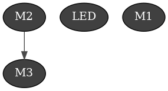
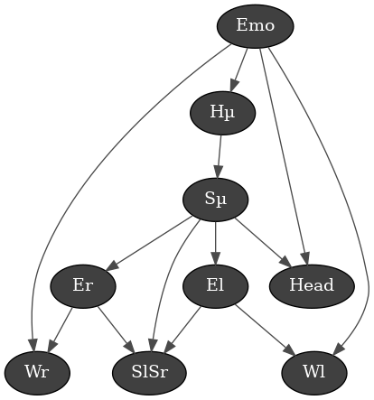
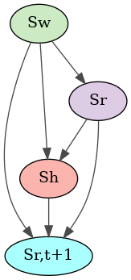

# BeWoDa

**Be**haviours from **Wo**rld **Da**ta

## Input data
* Temperature (inside/outside) : {-20 ; 50} $\pm$ 5 °C  ==> **14 classes**
* Humidity (inside/outside) :  {0 ; 100} $\pm$ 5 %  ==> **20 classes**
* Atmospheric pressure : {850 ; 1050} $\pm$ 50 hPa  ==> **4 classes**
* CO$_2$ concentration : {200 ; 1200} $\pm$ 200 ppm  ==> **5 classes**
* Emotions : {'neutral', 'happy', 'sad', 'surprise', 'anger'}  ==> **5 classes**
* Body position : 18*2 values

Total state (without Body Positions) : $14\times 20 \times 4 \times 5 \times 5 = 28000$.

## Output commands
* Motor 1 (base) position : {}
* Motor 2 (head bow) position : {}
* Motor 3 (head yaw) position : {}
* LED rgb : {0 ; 255}\*3 $\pm$ 10 ==> **26 classes**\*3
* LED intensity : {0 ; 255} $\pm$ 10 ==> **26 classes**

## States
$$s = s_r + s_w + s_h$$

With $s_r$ the state of Yokobo (position of motors and light colour), $s_w$ the state of the world (temperature, humidity, AP and CO$_2$ level) and $s_h$ the state of the person (body positions and emotions).

Let's see the relationship of the parameters of each state, independently of the other states.

### State of the world : $s_w$
We can draw the Directed Acyclic Graph (DAG) as follow:

We can assume that all world data, i.e. meteorological data, are a function of the current **time**. Since Yokobo is working with a quite short time approach, we disregarded the current date, which has also an influence. Then, the **atmospheric pressure** influences the **temperatures**, **humidity data** and **CO2 level**. The latter is also related to inside **humidity** and **temperature**.

### State of the robot (Yokobo) : $s_r$
We can draw the DAG as follow:

The position of the motors and the **LED colour** are independent, besides the link that exists between **M2** and **M3**.

### State of the human : $s_h$
We can draw the DAG as follow:

With **Hµ** the mean position between the two hips; **Sµ** the mean position between the two shoulders; **El** and **Er** the left/right elbow position; **Wl** and **Wr** the left/right wrist position; **SlSr** the horizontal distance between the two shoulders.

With this graph, we define the hip as the *origin* of the body, the point that defines the positions of the others. Because for the interaction we have with Yokobo the position of the hips and extremities is not important, we can use the mean position. However, for the shoulders, the positions of the left and right are important. Because we are using DAG, we cannot use the position of each shoulder, since we would have a cycle. Then, to overcome this problem, we can add the length between the two shoulders (**SlSr**), and we can assume it does not influence **Sµ**. We also hypothesise that the **emotion** of the person mostly influences the position of their hands and head and the rest of the body through the hips.

## Bayesian Network
The goal of the Bayesian Network is to remember and predict the future state of the robot ($s_{r,t+1}$) according to the current state ($s_w$, $s_h$ and $s_r$), we can draw the general diagram as follow:

Since we want to see the possible state of the robot, according to the current observation of the world, the current state of Yokobo ($s_r$) affects the user state ($s_h$) and the user will affect the *future* state of Yokobo ($s_{r,t+1}$).
If we expand the general DAG by connecting the previous graphs, we can obtain the detailed bayesian network DAG:

To simplify the connections, some hypotheses are made. First, since the user is interacting with Yookobo inside the home, the temperature and humidity outside are not affecting the user. Then, the connection to the user (to $s_h$) is only done to the emotion (**Emo**), the head (**Head**), the hip center (**Hµ**), the left and right wrist (**Wl** and **Wr**), as a simplification. Similarly, the connection from the user is also done from those nodes.

## Reinforcement Learning Network
